# Library Management System – DB Project Part 2

✅ SELECT Queries

1. GET /loans/overdue → List all overdue loans with member name, book title, due date

      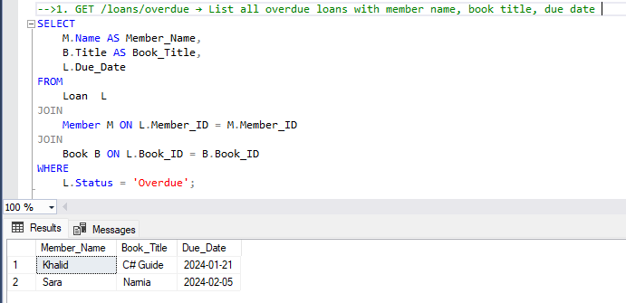 

 2. GET /books/unavailable → List books not available
	
     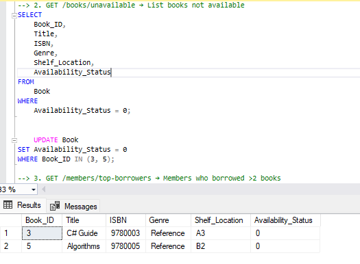 

3. GET /members/top-borrowers → Members who borrowed >2 books 

    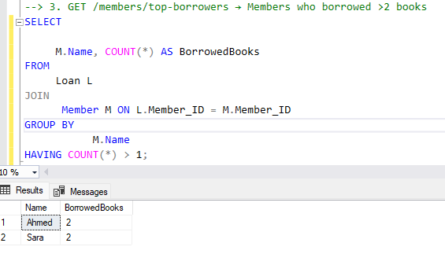 

4. GET /books/:id/ratings → Show average rating per book -- Declare the variable

    
    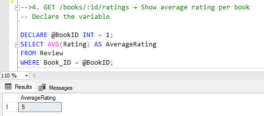 

5. GET /libraries/:id/genres → Count books by genre

     
    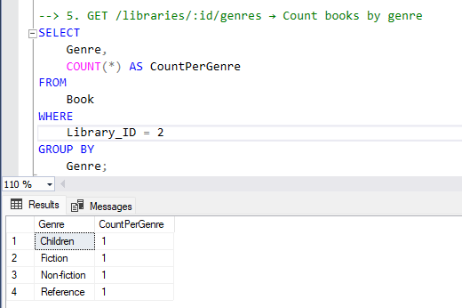

 6. GET /members/inactive → List members with no loans

      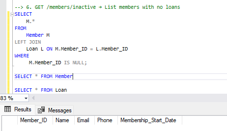

 7. GET /payments/summary → Total fine paid per member

       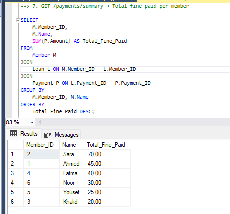

 8. GET /reviews → Reviews with member and book info

      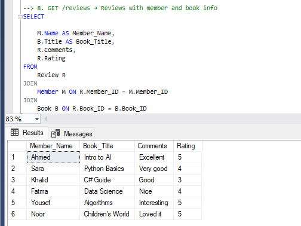

9. GET /books/popular → List top 3 books by number of times they were loaned

      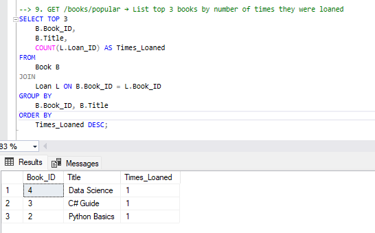

10. GET /members/:id/history → Retrieve full loan history of a specific member including book title, loan & return dates

     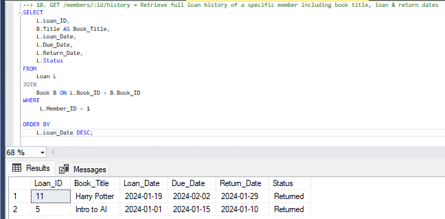

11. GET /books/:id/reviews → Show all reviews for a book with member name and comments

       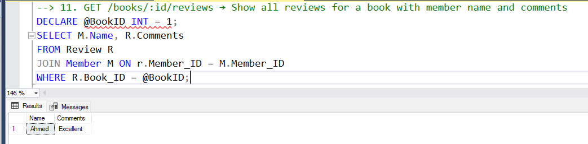
 
  12. GET /libraries/:id/staff → List all staff working in a given library

         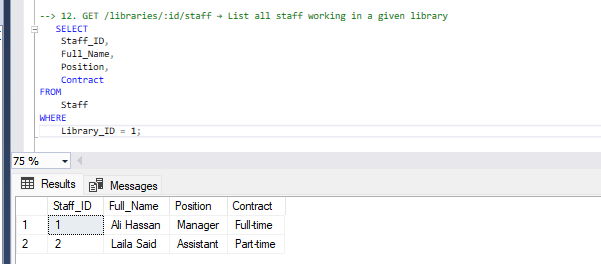

 13. GET /books/price-range?min=5&max=15 → Show books whose prices fall within a given range

       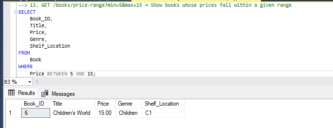

14. GET /loans/active → List all currently active loans (not yet returned) with member and book info
       
      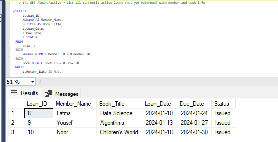

 15. GET /members/with-fines → List members who have paid any fine

        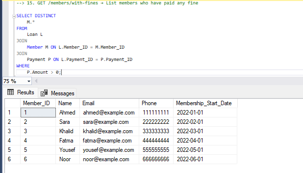

 16. GET /books/never-reviewed →  List books that have never been reviewed

       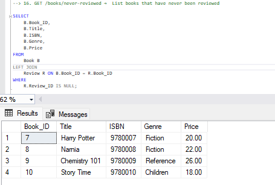

 

