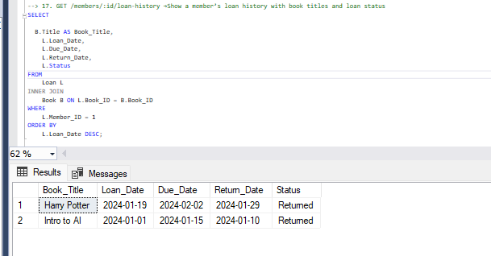
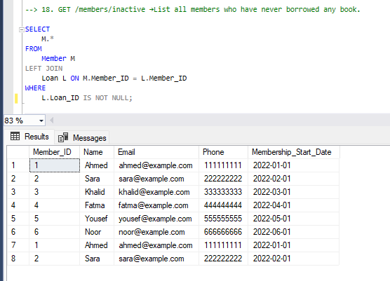
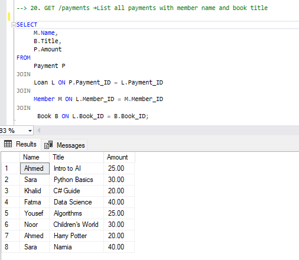
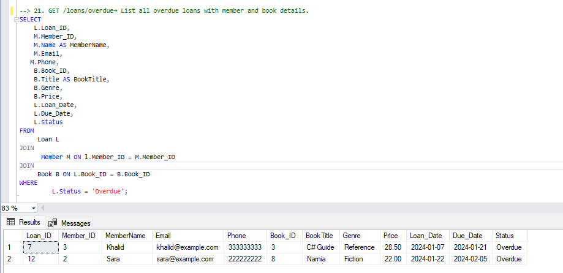
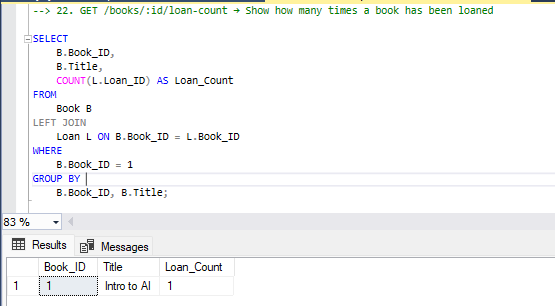
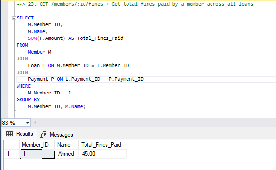
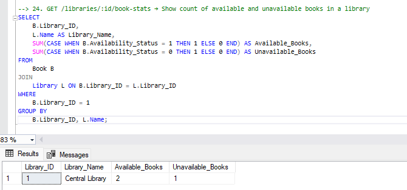
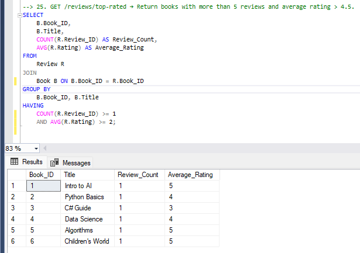
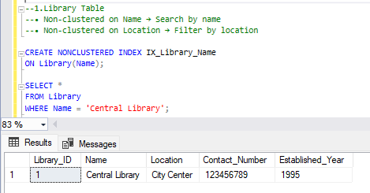
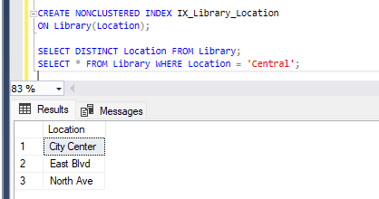

# Library Management System – DB Project Part 2

✅ SELECT Queries

1. GET /loans/overdue → List all overdue loans with member name, book title, due date

       

 2. GET /books/unavailable → List books not available
	
      

3. GET /members/top-borrowers → Members who borrowed >2 books 

     

4. GET /books/:id/ratings → Show average rating per book -- Declare the variable

    
     

5. GET /libraries/:id/genres → Count books by genre

     
    

 6. GET /members/inactive → List members with no loans

      
 

 7. GET /payments/summary → Total fine paid per member

       

 8. GET /reviews → Reviews with member and book info

      

9. GET /books/popular → List top 3 books by number of times they were loaned

      

10. GET /members/:id/history → Retrieve full loan history of a specific member including book title, loan & return dates

     

11. GET /books/:id/reviews → Show all reviews for a book with member name and comments

       
 
  12. GET /libraries/:id/staff → List all staff working in a given library

         

 13. GET /books/price-range?min=5&max=15 → Show books whose prices fall within a given range

       

14. GET /loans/active → List all currently active loans (not yet returned) with member and book info
       
      

 15. GET /members/with-fines → List members who have paid any fine

        

 16. GET /books/never-reviewed →  List books that have never been reviewed

       

17. GET /members/:id/loan-history →Show a member’s loan history with book titles and loan status

       

 18. GET /members/inactive →List all members who have never borrowed any book.
 
        
  
 
  19. GET /books/never-loaned → List books that were never loaned
  
        

20. GET /payments →List all payments with member name and book title

      
 
 21. GET /loans/overdue→ List all overdue loans with member and book details

       

 22. GET /books/:id/loan-count → Show how many times a book has been loaned
  
       

23. GET /members/:id/fines → Get total fines paid by a member across all loans
 
       

 24. GET /libraries/:id/book-stats → Show count of available and unavailable books in a library
 
        

 25. GET /reviews/top-rated → Return books with more than 5 reviews and average rating > 4.5.
  
        
  
✅  Indexing Strategy – Performance Optimization

Apply indexes to speed up commonly-used queries: 

1. Library Table 

• Non-clustered on Name → Search by name 

   

• Non-clustered on Location → Filter by location 

   

2. Book Table 

• Clustered on LibraryID, ISBN → Lookup by book in specific library

• Non-clustered on Genre → Filter by genre 

3. Loan Table 

• Non-clustered on MemberID → Loan history

• Non-clustered on Status → Filter by status 

• Composite index on BookID, LoanDate, ReturnDate → Optimize overdue checks 
 
 
 
 

 

