# Library Management System – DB Project Part 2

✅ SELECT Queries

1. GET /loans/overdue → List all overdue loans with member name, book title, due date

       

 2. GET /books/unavailable → List books not available
	
      

3. GET /members/top-borrowers → Members who borrowed >2 books 

     

4. GET /books/:id/ratings → Show average rating per book -- Declare the variable

    
     

5. GET /libraries/:id/genres → Count books by genre

     
    

 6. GET /members/inactive → List members with no loans

      
 

 7. GET /payments/summary → Total fine paid per member

       

 8. GET /reviews → Reviews with member and book info

      

9. GET /books/popular → List top 3 books by number of times they were loaned

      

10. GET /members/:id/history → Retrieve full loan history of a specific member including book title, loan & return dates

     

11. GET /books/:id/reviews → Show all reviews for a book with member name and comments

       
 
  12. GET /libraries/:id/staff → List all staff working in a given library

         

 13. GET /books/price-range?min=5&max=15 → Show books whose prices fall within a given range

       

14. GET /loans/active → List all currently active loans (not yet returned) with member and book info
       
      

 15. GET /members/with-fines → List members who have paid any fine

        

 16. GET /books/never-reviewed →  List books that have never been reviewed

       

17. GET /members/:id/loan-history →Show a member’s loan history with book titles and loan status

       

 18. GET /members/inactive →List all members who have never borrowed any book.
 
        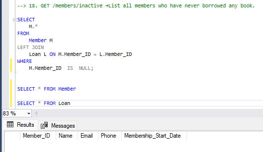
  
 
  19. GET /books/never-loaned → List books that were never loaned
  
        

20. GET /payments →List all payments with member name and book title

      
 
 21. GET /loans/overdue→ List all overdue loans with member and book details

       

 22. GET /books/:id/loan-count → Show how many times a book has been loaned
  
       

23. GET /members/:id/fines → Get total fines paid by a member across all loans
 
       

 24. GET /libraries/:id/book-stats → Show count of available and unavailable books in a library
 
        

 25. GET /reviews/top-rated → Return books with more than 5 reviews and average rating > 4.5.
  
        
  
✅  Indexing Strategy – Performance Optimization

Apply indexes to speed up commonly-used queries: 

1. Library Table 

• Non-clustered on Name → Search by name 

   

• Non-clustered on Location → Filter by location 

   

2. Book Table 

• Clustered on LibraryID, ISBN → Lookup by book in specific library

   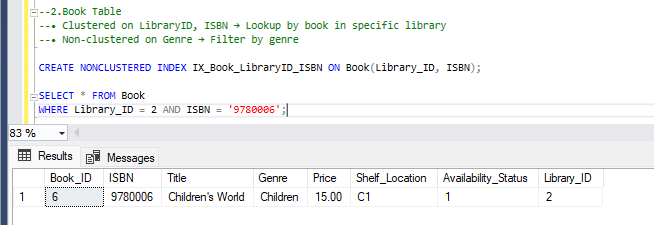

• Non-clustered on Genre → Filter by genre 

   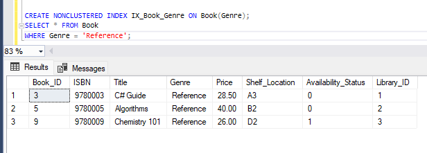

3. Loan Table 

• Non-clustered on MemberID → Loan history

  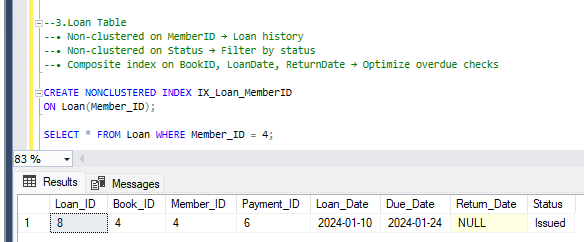

• Non-clustered on Status → Filter by status 

   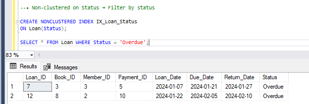

• Composite index on BookID, LoanDate, ReturnDate → Optimize overdue checks 
 
   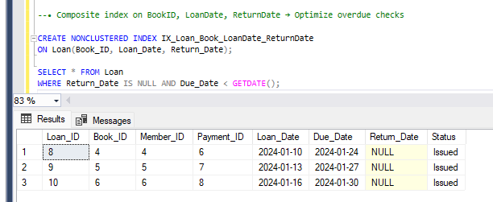

✅  Views – Frontend Integration Support 

1. ViewPopularBooks --> Books with average rating > 4.5 + total loans 

   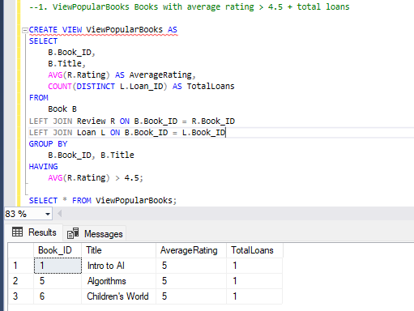

2. ViewMemberLoanSummary --> Member loan count + total fines paid

   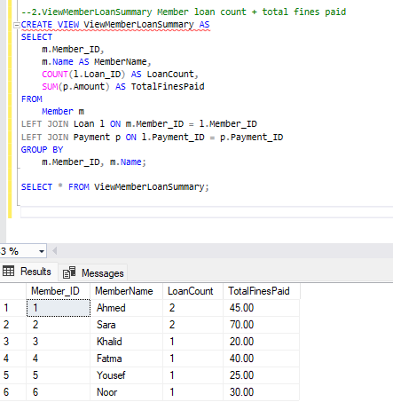

3. ViewAvailableBooks --> Available books grouped by genre, ordered by price

   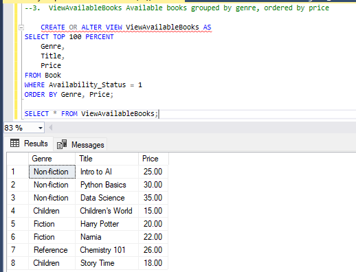

4. ViewLoanStatusSummary --> Loan stats (issued, returned, overdue) per library
      
      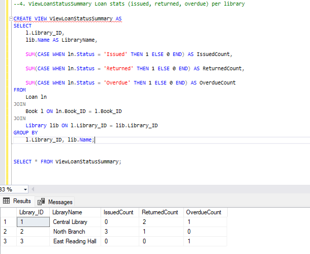

 
5. ViewPaymentOverview--> Payment info with member, book, and status. 

     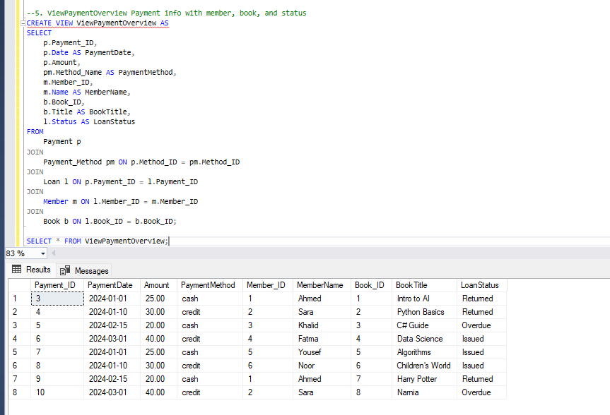

✅ Functions – Reusable Logic

1. GetBookAverageRating(BookID) Returns average rating of a book

    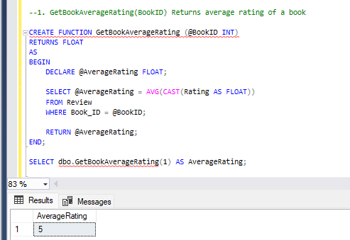

 2. GetNextAvailableBook(Genre, Title, LibraryID) --> Fetches the next available book 

  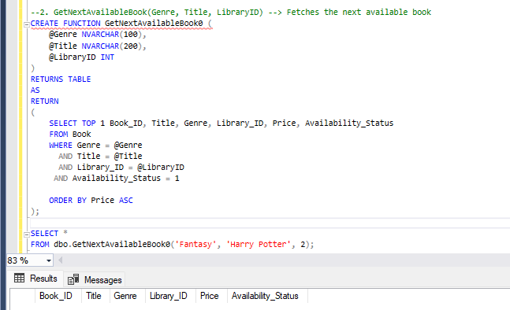

    
3. CalculateLibraryOccupancyRate(LibraryID)--> Returns % of books currently issued 
      
      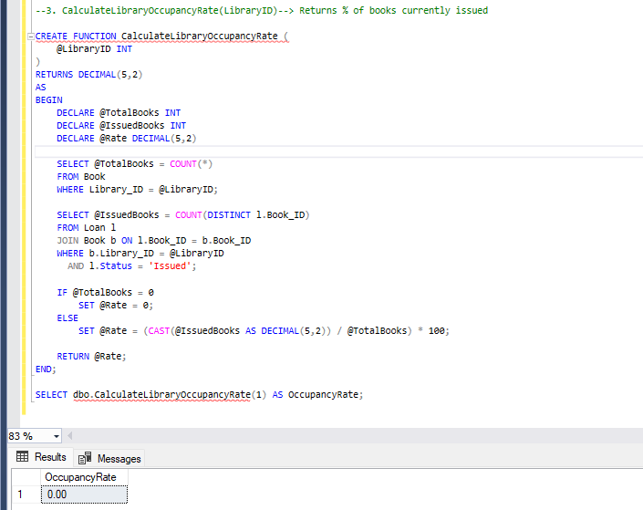
    
4. fn_GetMemberLoanCount-->  Return the total number of loans made by a given member

     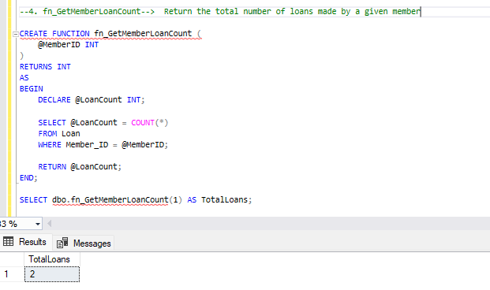

5. fn_GetLateReturnDays--> Return the number of late days for a loan (0 if not late)

    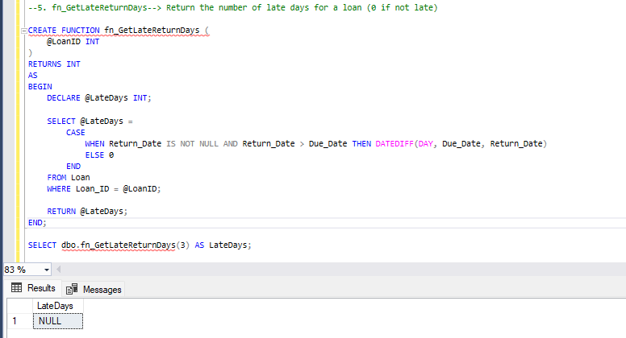

 
6. fn_ListAvailableBooksByLibrary--> Returns a table of available books from a specific library.

   

 7. fn_GetTopRatedBooks--> Returns books with average rating ≥ 4.5

     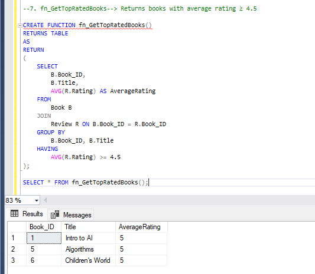
 

 8. fn_FormatMemberName-->  Returns  the  full  name  formatted  as  "LastName, FirstName"

    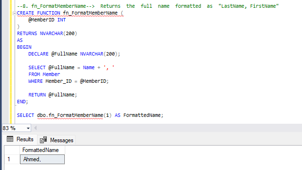
 
✅ Stored Procedures – Backend Automation

1. sp_MarkBookUnavailable(BookID)--> Updates availability after issuing 

    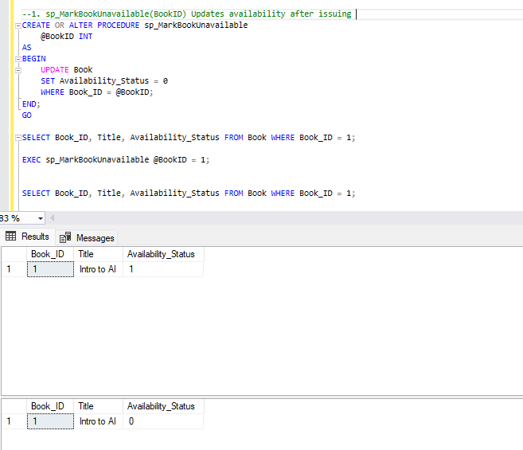

2. sp_UpdateLoanStatus()--> Checks dates and updates loan statuses
      
        
    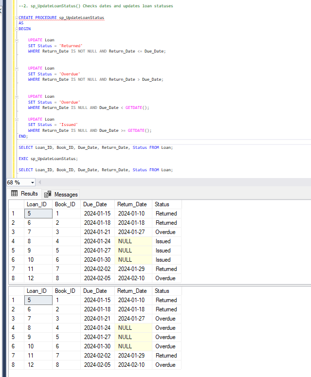

3. sp_RankMembersByFines()--> Ranks members by total fines paid 

    
    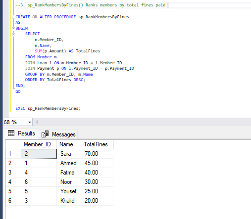

✅ Triggers – Real-Time Business Logic

1. trg_UpdateBookAvailability After new loan → set book to unavailable 

     
    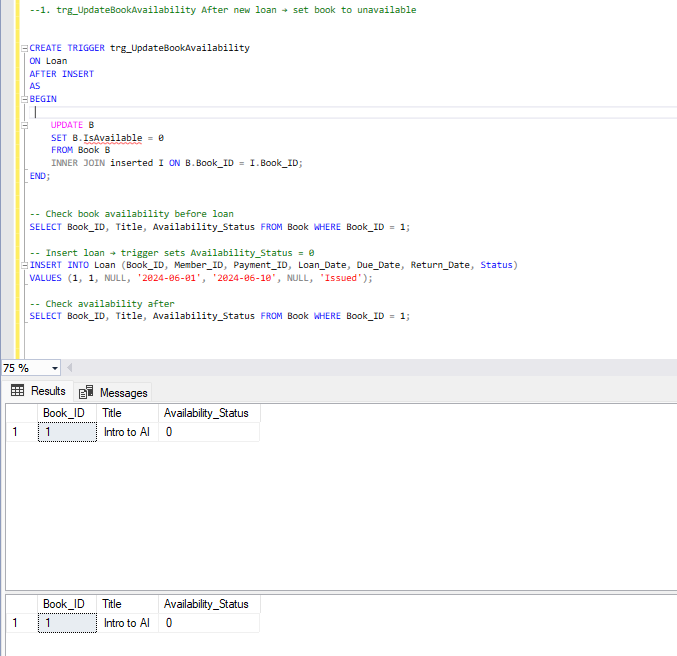

2. trg_CalculateLibraryRevenue After new payment → update library revenue

     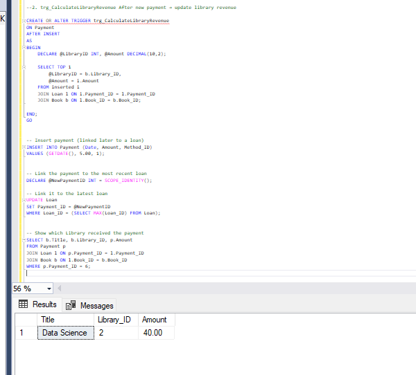 

3. trg_LoanDateValidation Prevents invalid return dates on insert

      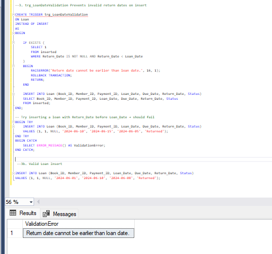

✅ Aggregation Functions – Dashboard Reports

1. Total fines per member 

      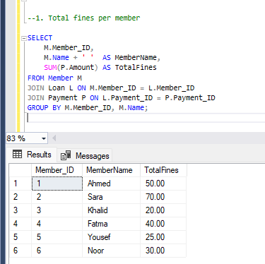 

2.  Most active libraries (by loan count) 

   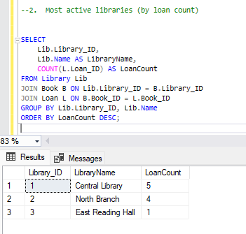 

3.  Avg book price per genre 

      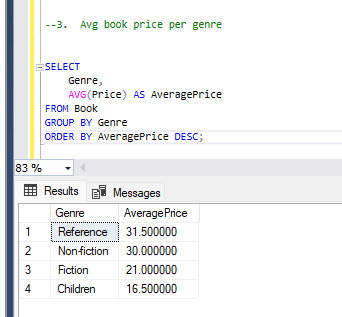 

4. Top 3 most reviewed books 

   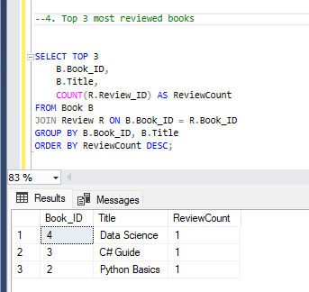 

5. Library revenue report 

  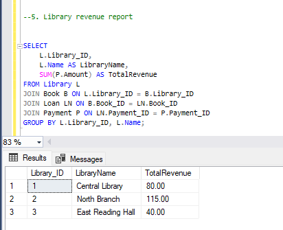  

6.  Member activity summary (loan + fines)

       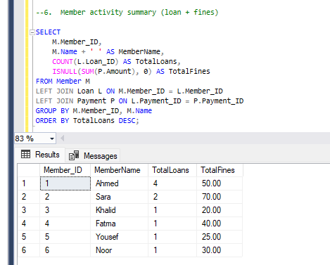 
 

✅ Advanced Aggregations – Analytical Insight

1. HAVING for filtering aggregates 

  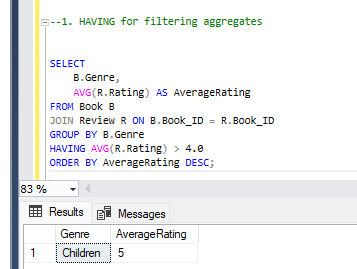    

2.  Subqueries for complex logic (e.g., max price per genre) 

      
  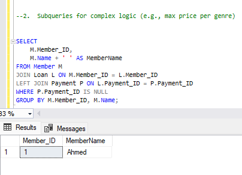   

3.  Occupancy rate calculations 

   
  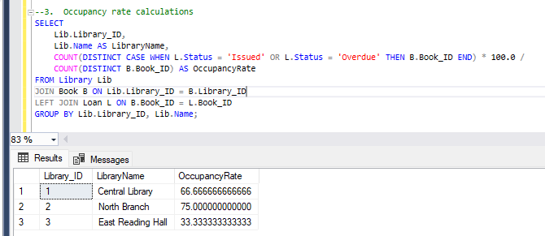  

4. Members with loans but no fine

   

  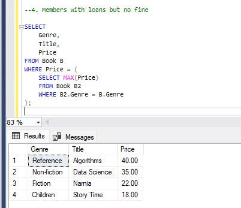  

5. Genres with high average ratings

    
  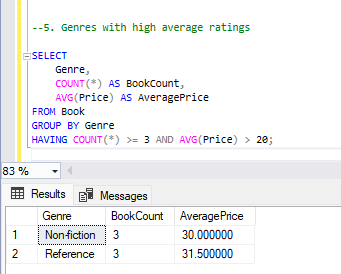 